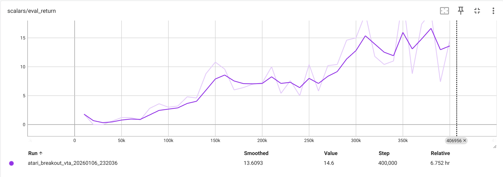
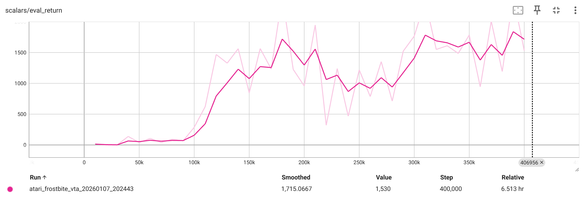
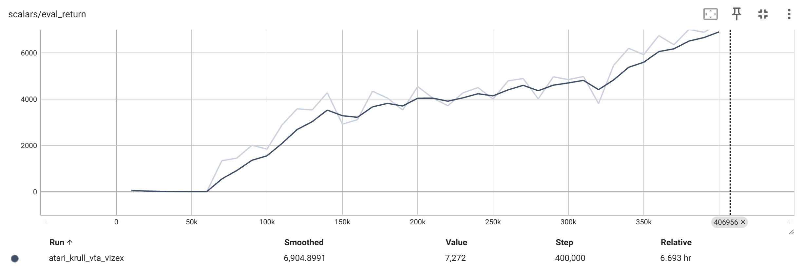
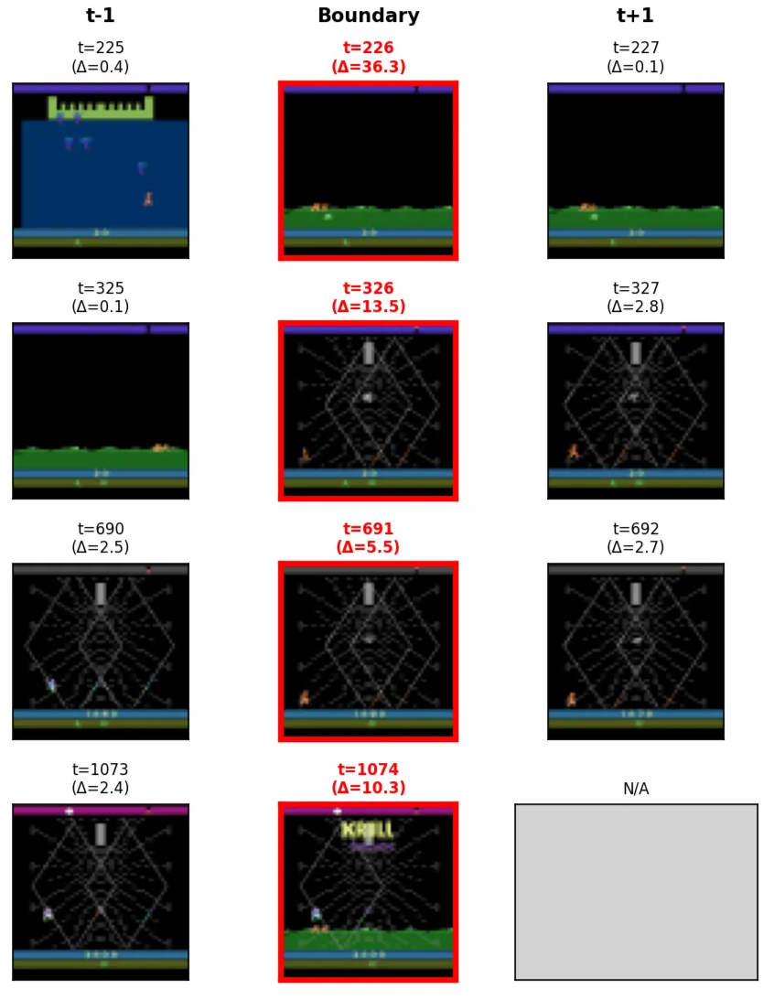
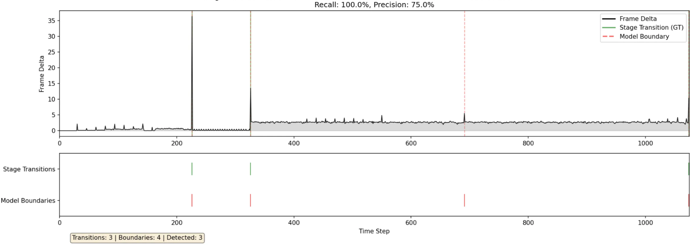

# Stable Deep World Model (VTA)

VTA (Variable Temporal Abstraction) とDreamerV3を組み合わせた実験コードです．DreamerV3の実装はpytorch版の実装 (https://github.com/NM512/dreamerv3-torch) に基づいています．実験にはAtari環境をメインに使用しています．

## セットアップ
- Python 3.9+ を想定
- 推奨: uv を使う場合  
  ```
  uv venv
  source .venv/bin/activate        # Windows: .venv\Scripts\activate
  uv sync                          # pyproject.toml から依存を解決
  ```
- pip を使う場合  
  ```
  pip install -r requirements-dreamerv3.txt
  ```
- GPU を使う場合は CUDA 対応の PyTorch を用意してください．

## 使い方

- 設定ファイル（yaml）
  `src_dreamerv3/configs.yaml`にこちらが使用した設定サンプルを用意しています．自分の環境に合わせて値を調整してください．

- 学習（Atari）  
  `chmod +x scripts/train_multi_atari.sh`で`train_multi_atari.sh`に実行権限を与え，`./scripts/train_multi_atari.sh`で実行．学習を開始するとlogdirの直下に日付とゲームタスクの名前に応じたフォルダが作成され学習経過が保存されます．

- 可視化
  `tensorboard --logdir ./logdir`で保存された学習経過を確認することが可能．

## プロジェクト構造
```
.
├── requirements-dreamerv3.txt        # 主要依存ライブラリ
├── scripts/                # 実行用シェルスクリプト
|   ├── train_multi_atari.sh # 複数の Atari 環境を学習 (1つでも可)
│   ├── train.sh            # Bouncing Balls 学可
│   └── visualize.sh        # 可視化サンプルコマンド
├── configs/                # 設定ファイル（JSON）
│   └── bouncing_balls_3070.json
├── main.py                 # 予備エントリポイント（現状未使用）
├── src_dreamerv3/          # DreamerV3 with VTAの実装パッケージ
│   ├── env/　　　　　　     # DreamerV3 (https://github.com/NM512/dreamerv3-torch) に準拠．複数の学習環境をまとめている
│   ├── config.yaml         # 学習設定
│   ├── dreamer.py          # DreamerV3 (https://github.com/NM512/dreamerv3-torch) に準拠．
│   ├── exploration.py      # DreamerV3 (https://github.com/NM512/dreamerv3-torch) に準拠．
│   ├── models.py           # DreamerV3 (https://github.com/NM512/dreamerv3-torch) に準拠．
│   ├── networks.py         # DreamerV3 (https://github.com/NM512/dreamerv3-torch) に準拠．
│   ├── parallel.py         # DreamerV3 (https://github.com/NM512/dreamerv3-torch) に準拠．
│   ├── tools.py            # DreamerV3 (https://github.com/NM512/dreamerv3-torch) に準拠．
│   └── vta.py              # VTAの実装まとめ
└── src_vta/                # 現行の VTA 実装パッケージ
    ├── config.py           # 実験設定（環境切替・学習ハイパーパラメータ）
    ├── model2.py           # 代替モデル案
    ├── utils.py            # 前処理・可視化・ログ周り
    ├── models/             # モデル実装
    │   ├── components.py   # Encoder/Decoder など下位ブロック
    │   ├── rssm.py         # 階層RSSM本体
    │   ├── vta.py          # 上位ラッパー
    │   └── __init__.py
    ├── data/               # データ生成・環境
    │   ├── bouncing_balls.py
    │   ├── maze_env.py
    │   ├── generate_npz.py
    │   ├── make_dataset.py
    │   └── __init__.py
    └── scripts/            # 実行用Pythonスクリプト
        ├── train_balls.py  # Bouncing Balls 学習ループ
        ├── train_maze.py   # 3D Maze 学習ループ
        └── visualize.py    # 学習済みモデルの可視化
```

## 補足
- `src/` 配下は将来の再構成用に空のスケルトンを置いています。現行コードはすべて `src_dreamerv3/` を見てください。

## 研究進捗
1. 関連研究．
   ---
    
    - VTA（ベースライン）
    - THICK（主な比較対象）
    - Hieros（固定ステップ数での階層化手法1）
    - CW-VAE（固定ステップ数での階層化手法2）
    - Director（固定ステップ数での階層化手法3）
    
    |  | **階層数** | **抽象化幅（固定 v.s. 動的）** | **方策学習** | **オンライン** |
    | --- | --- | --- | --- | --- |
    | **VTA** | 2 | 動的 | × | × |
    | **LOVE** | 2 | 動的 | 〇 | × |
    | **THICK** | 2 | 動的 | 〇 | 〇 |
    | **Hieros** | 2 ~ 3 | 固定 | 〇 | 〇 |
    | **CW-VAE** | 2 ~ 3 | 固定 | × | × |
    | **Director** | 2 | 固定 | 〇 | 〇 |
    | **Ours** | 2 ~ | 動的 | 〇 | 〇 |
   
2. ベースラインとなる研究を選定できている．
    
    ---
    
    固定ステップ数での時間抽象化を行わず，かつ時間階層を3層以上に増やすことが可能なVTAを階層化手法のベースラインとして利用．
    
    世界モデルのベースとしては汎化性能に優れたDreamerV3を使用．
   
3. ベースラインモデル（もしくはその再現実装）を動かせている．
    
    ---
    
    VTAの概念を階層化の手法として利用し，DreamerV3のrssmを置き換える．
    
    現状は，単純に抽象状態zの層を追加し，観測状態と結合して方策ネットワークに入力する形で利用．
    
    結果としてDreamerV3と同程度の性能は出せたものの，方策学習にはあまり寄与していないことが実験から分かった．

    以下に結果を添付する．
    
    
    
   
4. 仮説を立てながら提案手法の実験を進められている．
    
    ---
    
    ベースライン（VTA）が行う境界検出にはいくつかの課題がある．
    
    1. VTAは観測が大きく切り替わる瞬間しか捉えることができないため，Atariのようなタスクでは意味のある区切りを発見することができず，ステージ遷移のようなわかりやすい区切りの発見にとどまっているため，方策学習にはあまり寄与できない．
    2. 単純に抽象状態zを観測状態sと結合して方策選択するだけでは境界を発見した意味が長期的な文脈の保持に留まってしまい，DreamerV3の性能を超えることは難しい．

    以下にkrullにおける境界検出の可視化を添付する
    
    
    
    これに対して以下の仮説を立てる．
    
    3. DreamerV3は内部で状態価値を推定しているため，この情報を境界検出に組み込むことでタスクに有意義な境界を発見することにつながる．
    4. Directorのように，Goal AEを学習することで抽象状態から現在何をするべきかを抽出し，方策学習に役立てられる．
    
    1の仮説では，状態価値は状態がどの程度報酬に近づいているかを表現しているため，その情報は鍵を入手した，敵を倒したといった観測だけでは得にくい情報も保持していることを意味していると考えているためである．
    
    2の仮説では，境界として検出した情報を長期的な文脈の保持だけでなく，最大限有意義に用いるためには，抽象化したゴール（サブゴール）を観測レベルに指示することが効果的だと考えているためである．
   
## DreamerV3 (torch) 統合
DreamerV3 の PyTorch 実装を `src_dreamerv3/` として統合しています。詳細は `docs/dreamerv3/README.md` を参照してください。

- 依存インストール: `pip install -r requirements-dreamerv3.txt`
- 例: `python -m src_dreamerv3.dreamer --configs dmc_vision --task dmc_walker_walk --logdir ./logdir/dmc_walker_walk`